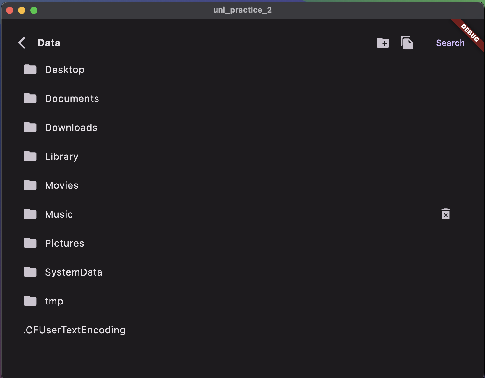
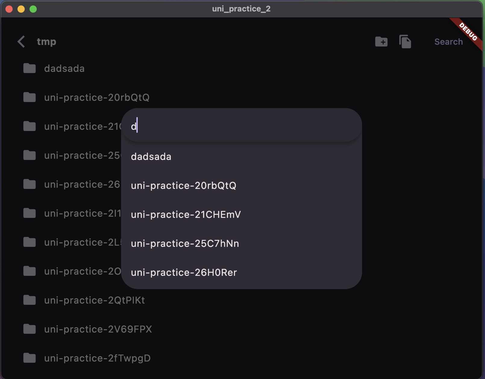
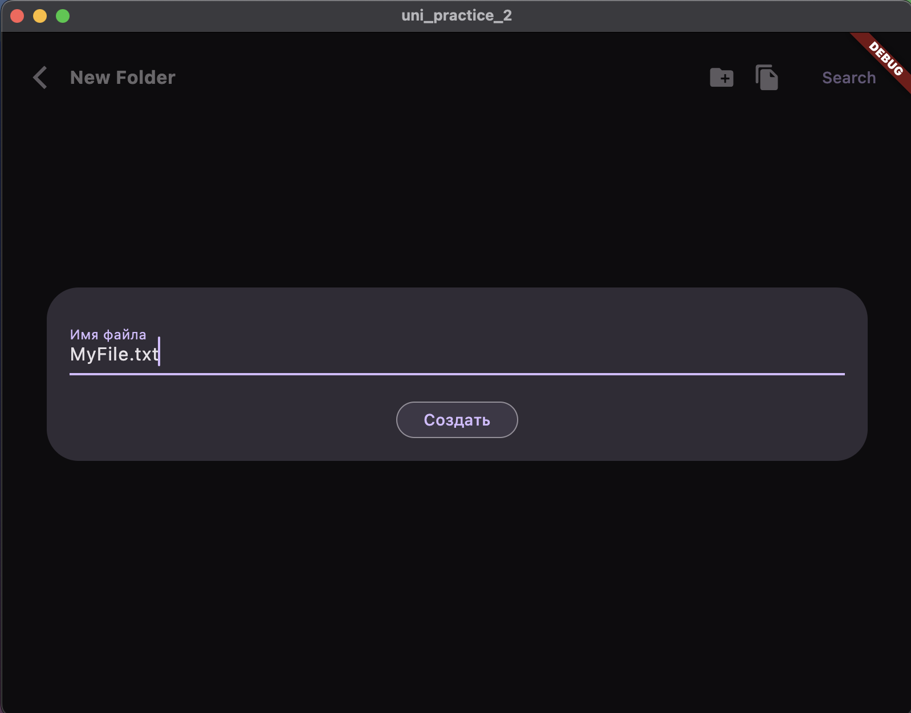
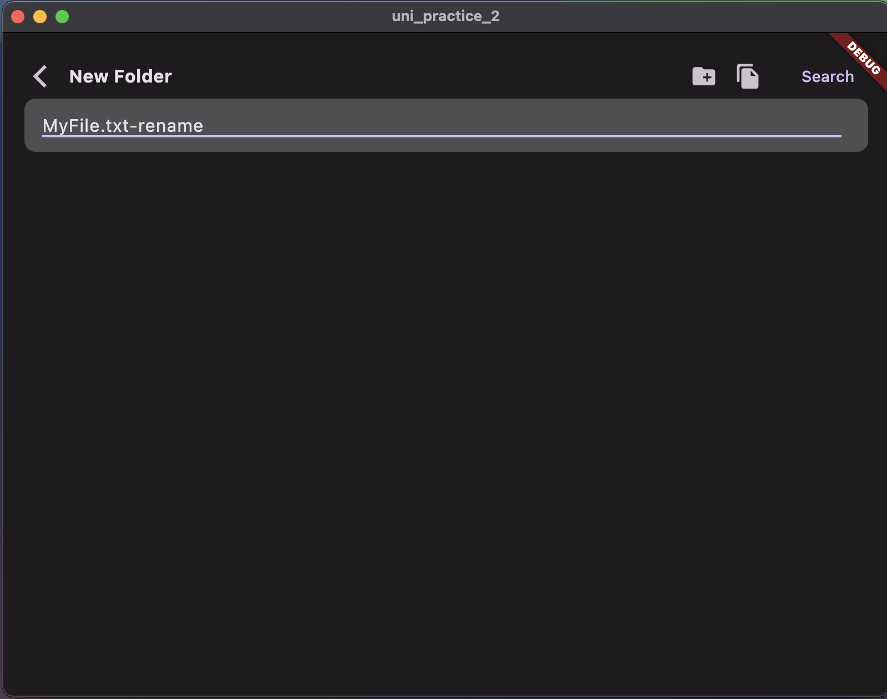

Использовался Flutter 3.15.0-15.2.pre • channel beta

Архитектура - MVVM.
Библиотека для реактивных ViewModel - [beholder](https://github.com/AlexanderFarkas/beholder), написана мной же.


Для запуска проекта необходимо:
```shell
flutter pub get
flutter run
```


## Скриншоты



